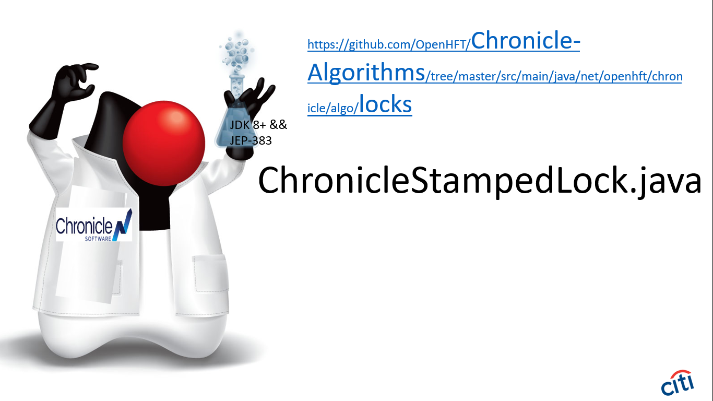
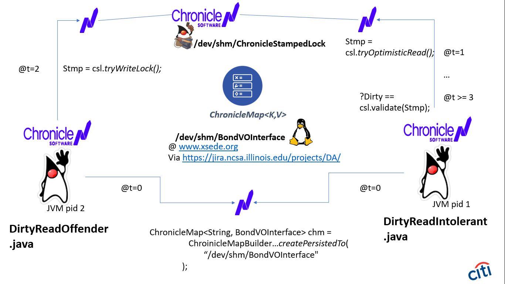

# Specification

|         |                                                             |
|:------- | ----------------------------------------------------------- |
| Title   | Wire Format API                                             |
| URL     | https://github.com/OpenHFT/RFC/blob/master/ChronicleStampedLock/    |
| Latest  | https://github.com/OpenHFT/RFC/blob/master/ChronicleStampedLock/ |
| Editor  | Ben.Cotton@rutgers.edu                                                  |
| License | Apache 2.0                                                  |
| Change Process | Users issue Pull Requests for the Editor's consideration. |
| Status  | Raw.                                                        |

# Goals
An RFC which embraces the need for a JEP-383 savvy equivalent of the j.u.c.l.StampedLock API.
A new ChronicleStampedLock capability will greatly empower capital markets
Java technologists to (on HPC platforms like
www.xsede.org, with zero gc) render
and aggregate
quantitative RISK metrics (for
optimistic and intolerant strategies).

